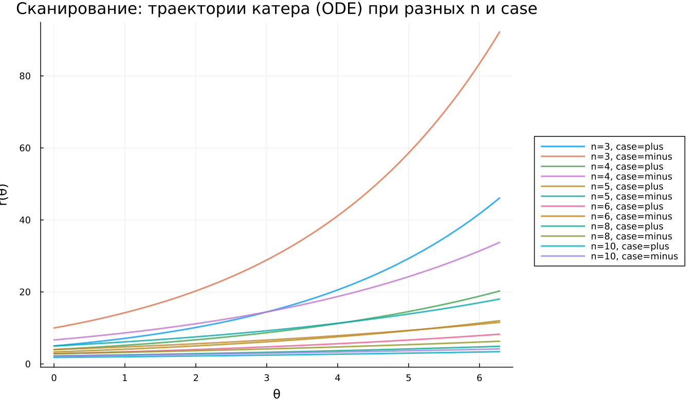

---
## Author
author:
  name: Наталья Ларина
  email: 1132236025@rudn.ru
  affiliation:
    - name: Российский университет дружбы народов
      country: Российская Федерация
      postal-code: 117198
      city: Москва
      address: ул. Миклухо-Маклая, д. 6

## Title
title: "Математическое моделирование"
subtitle: "Лабораторная работа № 2"
license: "CC BY"
---

# Цель работы

Рассмотрим пример построения математической модели, которая помогает выбрать рациональную стратегию в задачах поиска и преследования. В качестве иллюстрации изучим ситуацию: в условиях тумана катер береговой охраны преследует лодку браконьеров. В некоторый момент туман рассеивается, и лодка фиксируется на расстоянии $k$ км от катера. Затем видимость снова исчезает, лодка продолжает движение прямолинейно, но направление неизвестно. Известно, что скорость катера в $n$ раз больше скорости лодки.

Требуется определить, по какой траектории должен двигаться катер, чтобы гарантированно нагнать лодку.

# Задание

1. Выполнить рассуждения и получить дифференциальные уравнения при условии, что скорость катера превосходит скорость лодки в $n$ раз.
2. Построить траектории катера и лодки для двух вариантов начальных условий.
3. По графику определить точку встречи (пересечения траекторий).

# Выполнение лабораторной работы

Положим $t_0=0$. Зафиксируем точку обнаружения лодки как начало отсчёта: $X_{\text{boat}}(0)=0$. В момент обнаружения катер находится на расстоянии $k$, то есть относительно лодки $X_{\text{cutter}}(0)=k$ (с учётом выбора направления вдоль линии визирования).

Перейдём к полярным координатам. Полюс — точка обнаружения лодки: $x_0=0$ (при этом $\theta=x_0=0$), а полярная ось $r$ направлена через точку положения катера береговой охраны.

## Нахождение радиуса перехода $x$

Пусть через время $t$ катер и лодка окажутся на одинаковом расстоянии $x$ от полюса. За это время лодка пройдёт путь $x$ (со скоростью $v$), а катер — $x+k$ или $x-k$ (в зависимости от того, по какую сторону от полюса он расположен относительно выбранного направления).

Тогда время движения для лодки равно $x/v$, а для катера — $(x+k)/(nv)$ или $(x-k)/(nv)$, поскольку скорость катера равна $nv$. Так как момент достижения радиуса $x$ общий, получаем равенства:

- для первого случая: $x/v=(x+k)/(nv)$;
- для второго случая: $x/v=(x-k)/(nv)$.

Из этих соотношений получаем два характерных расстояния:

- $x_1=\dfrac{k}{n+1}$ при $\theta=0$;
- $x_2=\dfrac{k}{n-1}$ при $\theta=-\pi$.

Далее задачу исследуем для обоих вариантов начального положения.

## Разложение скорости катера и система ОДУ

После того как катер окажется на том же радиусе, что и лодка, прямолинейное движение уже не гарантирует перехват при неизвестном направлении. Поэтому катер должен начать движение вокруг полюса, одновременно удаляясь от него с радиальной скоростью, равной скорости лодки $v$.

Разложим скорость катера на компоненты:

- радиальная: $v_r=\dfrac{dr}{dt}$;
- тангенциальная: $v_t=r\dfrac{d\theta}{dt}$.

Чтобы катер не уступал лодке по удалению от полюса, задаём
$$(dr/dt)=v.$$

Полная скорость катера равна $nv$, значит по теореме Пифагора для ортогональных компонент:
$$v_t=\sqrt{(nv)^2-v^2}=v\sqrt{n^2-1}.$$

Отсюда:
$$r\dfrac{d\theta}{dt}=v\sqrt{n^2-1}.$$

Итак, исходная задача сводится к решению системы:
$$
\begin{cases}
\dfrac{dr}{dt}=v,\\
r\dfrac{d\theta}{dt}=v\sqrt{n^2-1}.
\end{cases}
$$

### Начальные условия

**Случай 1**
$$
\begin{cases}
\theta_0=0,\\
r_0=\dfrac{k}{n+1}.
\end{cases}
$$

**Случай 2**
$$
\begin{cases}
\theta_0=-\pi,\\
r_0=\dfrac{k}{n-1}.
\end{cases}
$$

Исключая $t$ из системы, получаем уравнение траектории:
$$\dfrac{dr}{d\theta}=\dfrac{r}{\sqrt{n^2-1}}.$$

Начальные условия остаются прежними. Решение этого ОДУ задаёт искомую траекторию катера в полярных координатах. После получения аналитической формы и численного решения можно построить траектории катера и лодки для обоих случаев.

## Условие задачи

В тумане катер береговой охраны преследует лодку браконьеров. В момент, когда видимость временно улучшается, лодка обнаруживается на расстоянии 20 км от катера. Затем лодка снова скрывается и движется прямолинейно в неизвестном направлении. Скорость катера в 5 раз больше скорости лодки, то есть $k=20$, $n=5$.

Для численного моделирования и построения графиков использовались внешние файлы с программным кодом:





## Анализ результатов моделирования

В рамках работы выполнено численное исследование движения катера, задаваемого уравнением
$$
\dfrac{dr}{d\theta}=\dfrac{r}{\sqrt{n^2-1}},
$$
а также сопоставление полученной траектории со движением лодки, которое задано аналитически (как прямолинейное в декартовой системе) и далее представлено в полярных координатах.

## Базовые эксперименты

### 1. Случай (case = plus)

На полярной диаграмме траектория катера имеет форму расходящейся спирали. Радиус $r$ возрастает при увеличении угла $\theta$, причём скорость роста увеличивается по мере удаления от центра. Это соответствует структуре уравнения: $dr/d\theta$ пропорциональна $r$, значит зависимость носит экспоненциальный характер по углу.

Лодка при этом движется по лучу: в декартовой системе это прямая, а в полярных координатах — траектория, соответствующая движению в фиксированном направлении.

Визуально заметно, что катер увеличивает радиус быстрее, и расстояние между кривыми меняется по мере движения.

### 2. Случай (case = minus)

Во втором варианте начальное значение радиуса больше, поэтому стартовая точка катера расположена дальше от полюса. Спираль сохраняет прежний тип роста, но вся траектория оказывается «сдвинутой наружу» по масштабу.

Таким образом, отличие режимов case=plus и case=minus связано главным образом с начальными условиями, а не с качественной формой траектории.

## Параметрическое сканирование по $n$

Исследовано влияние параметра $n$ на динамику для обоих режимов начальных условий.

Из уравнения видно, что темп изменения задаётся коэффициентом $1/\sqrt{n^2-1}$. При росте $n$ этот множитель уменьшается, поэтому:

- при меньших $n$ спираль расходится заметно быстрее;
- при больших $n$ радиальный рост становится более медленным;
- траектории выглядят более «пологими» и менее быстро уходят наружу.

На графике видно, что для $n=3$ рост наиболее интенсивный, а для $n=10$ — минимальный среди рассмотренных.

## Анализ метрики scale_ratio

Введена метрика
$$
\text{scale\_ratio}=\dfrac{r_{\text{final}}}{\max(r_{\text{boat}})},
$$
которая показывает относительный масштаб траектории катера по сравнению с максимальным радиусом лодки в рамках выбранного интервала моделирования.

По графику можно заключить:

- при малых $n$ метрика существенно превышает 1 — катер «наращивает радиус» значительно быстрее лодки;
- при увеличении $n$ значение заметно снижается;
- при больших $n$ масштабы траекторий становятся ближе друг к другу.

Для режима case=minus значения выше, что объясняется большим стартовым радиусом.

## Время вычислений

Проведён бенчмарк численного решения ОДУ при различных значениях $n$.

Наблюдения:

- время расчёта находится на уровне порядка $6\times 10^{-4}$ секунды;
- выраженной зависимости от $n$ не выявлено;
- небольшие флуктуации обусловлены адаптивным выбором шага интегрирования и особенностями численных процедур.

# Выводы

1. Траектория катера в полярных координатах описывается экспоненциально расходящейся спиралью.
2. Параметр $n$ определяет «крутизну» спирали: чем больше $n$, тем медленнее растёт радиус $r$ как функция $\theta$.
3. Выбор начального условия (case) влияет на масштаб и стартовую позицию, но не меняет тип траектории.
4. Численная схема демонстрирует устойчивость, а затраты по времени слабо зависят от параметров модели.

Численные результаты согласуются с аналитическими выводами, полученными из структуры дифференциального уравнения.

# Список литературы {.unnumbered}

1. [Задача о погоне](https://esystem.rudn.ru/pluginfile.php/2290141/mod_resource/content/2/Лабораторная%20работа%20№%201.pdf)
