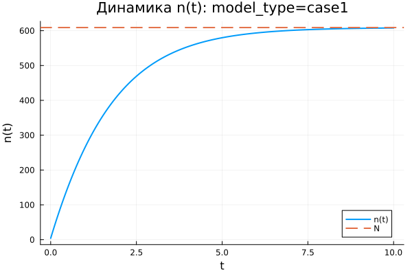
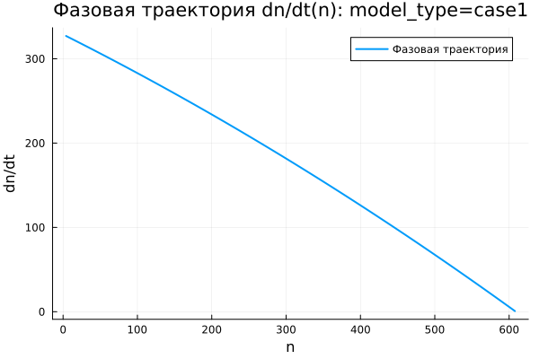
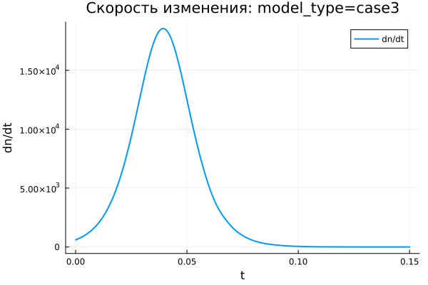

---
author:
  name: Наталья Ларина
  email: 1132236025@rudn.ru
  affiliation:
    - name: Российский университет дружбы народов
      country: Российская Федерация
      city: Москва
title: "Математическое моделирование"
subtitle: "Лабораторная работа №7"
license: "CC BY"
date: today
date-format: "YYYY-MM-DD"
---

# Вводная часть

## Цель работы

Изучить модель эффективности рекламной кампании и проанализировать, как информация о товаре распространяется среди потенциальных покупателей.

## Задание

1. Рассмотреть математическую модель эффективности рекламы.
2. Построить графики распространения информации для трёх заданных случаев.
3. Проанализировать скорость изменения числа информированных покупателей.
4. Выполнить параметрическое исследование моделей.
5. Сравнить полученные результаты для трёх вариантов.

# Теоретические сведения

## Модель распространения рекламы

Обозначим:

- $N$ — общее количество потенциальных покупателей;
- $n(t)$ — число покупателей, уже знающих о товаре;
- $t$ — время, прошедшее с начала рекламной кампании;
- $\frac{dn}{dt}$ — скорость распространения информации о товаре.

## Основная идея модели

Информация о продукции распространяется по двум каналам:

1. Через рекламную кампанию.
2. Через общение покупателей друг с другом.

Общий вид модели записывается следующим образом:

$$
\frac{dn}{dt} =
(\alpha_1(t) + \alpha_2(t)n(t))(N - n(t)).
$$

## Смысл множителей

Множитель $(N - n(t))$ показывает количество покупателей, которые ещё не получили информацию о товаре.

Когда $n(t)$ приближается к $N$, выполняется соотношение:

$$
N - n(t) \rightarrow 0.
$$

Поэтому скорость распространения информации постепенно уменьшается.

## Уровень насыщения

Величина $N$ задаёт предельный уровень охвата аудитории:

$$
n(t) \rightarrow N.
$$

Если $n = N$, все потенциальные покупатели уже знают о товаре, поэтому дальнейший рост числа информированных клиентов прекращается.

# Постановка задачи

## Исходные данные

Заданы параметры:

$$
N = 609,
$$

$$
n(0) = 4.
$$

Требуется построить графики функции $n(t)$ для трёх моделей распространения рекламы.

## Первая модель

$$
\frac{dn}{dt} =
(0.54 + 0.00016n(t))(N - n(t)).
$$

В первой модели прямое рекламное воздействие играет более заметную роль, чем передача информации между покупателями.

## Вторая модель

$$
\frac{dn}{dt} =
(0.000021 + 0.38n(t))(N - n(t)).
$$

Во второй модели основной вклад связан с распространением информации от уже информированных покупателей к тем, кто ещё не знает о товаре.

## Третья модель

$$
\frac{dn}{dt} =
(0.2\cos t + 0.2\cos 2t \cdot n(t))(N - n(t)).
$$

В третьей модели коэффициенты зависят от времени, поэтому интенсивность распространения информации меняется в ходе процесса.

# Базовые эксперименты

## Первая модель: динамика $n(t)$

## Первая модель: скорость изменения

## Первая модель: фазовая траектория

## Анализ первой модели

Для первой модели характерен монотонный рост функции $n(t)$.

Основные признаки поведения модели:

- значение $n(t)$ постепенно приближается к $N = 609$;
- наиболее быстрый рост наблюдается в начале процесса;
- затем скорость распространения информации уменьшается;
- решение подходит к уровню насыщения снизу и не превышает его.

## Вывод по первой модели

Первая модель описывает процесс насыщаемого роста.

При приближении $n(t)$ к $N$ множитель $(N - n)$ уменьшается, поэтому:

$$
\frac{dn}{dt} \rightarrow 0.
$$

Состояние $n = N$ является равновесным, поскольку дальнейшее увеличение числа информированных покупателей невозможно.

# Вторая модель

## Вторая модель: динамика $n(t)$

## Вторая модель: скорость изменения

## Вторая модель: фазовая траектория

## Анализ второй модели

Во второй модели рост происходит значительно быстрее, чем в первом случае.

График $n(t)$ имеет S-образный вид:

- на начальном участке рост идёт медленно;
- затем скорость резко возрастает;
- после достижения максимального темпа рост замедляется;
- решение быстро приближается к уровню $N$.

## Максимальная скорость

Во второй модели скорость распространения рекламы имеет выраженный внутренний максимум.

Это связано с действием двух противоположных факторов:

- множитель $bn$ усиливает распространение информации;
- множитель $(N - n)$ ограничивает дальнейший рост.

Максимальная скорость достигается не в начале процесса, а на участке, где число информированных покупателей уже достаточно велико, но запас до уровня насыщения ещё сохраняется.

# Третья модель

## Третья модель: динамика $n(t)$

## Третья модель: скорость изменения

## Третья модель: фазовая траектория

## Анализ третьей модели

Третья модель также приводит систему к насыщению.

Её особенность состоит в наличии временных множителей:

$$
\cos t,\quad \cos 2t.
$$

На выбранном коротком интервале эти функции остаются положительными, поэтому решение не переходит к колебательному режиму, а продолжает монотонно возрастать.

## Вывод по третьей модели

Третья модель описывает насыщаемый рост при переменных коэффициентах.

Несмотря на присутствие тригонометрических функций, общий характер динамики сохраняется:

$$
n(t) \rightarrow N.
$$

# Сравнение базовых моделей

## Качественное различие

| Характеристика | case1 | case2 | case3 |
|---|---|---|---|
| Вид роста | монотонный | S-образный | S-образный |
| Скорость в начале | максимальная | малая | малая |
| Максимум $\frac{dn}{dt}$ | в начале | внутри интервала | внутри интервала |
| Предельное значение | $N$ | $N$ | $N$ |
| Коэффициенты | постоянные | постоянные | зависят от времени |

## Общая особенность

Во всех трёх моделях присутствует множитель:

$$
N - n(t).
$$

Он отвечает за насыщение и не позволяет числу информированных покупателей расти неограниченно.

# Параметрическое исследование

## Зависимость $n_{final}$ от параметра $a$

## Анализ зависимости $n_{final}(a)$

Большинство точек расположено около уровня $N = 609$.

Это показывает, что при основной части наборов параметров система успевает достичь насыщения.

Заметное отклонение наблюдается во второй модели при малом значении параметра $a$.

## Зависимость $n_{final}$ от параметра $b$

## Анализ зависимости $n_{final}(b)$

Параметр $b$ определяет вклад распространения информации через взаимодействие покупателей.

При увеличении $b$ реклама распространяется быстрее.

Если значение параметра недостаточно велико, система может не успеть выйти на уровень насыщения за выбранный интервал моделирования.

# Максимальные значения

## Зависимость $n_{max}$ от параметра $a$

## Зависимость $n_{max}$ от параметра $b$

## Анализ $n_{max}$

Так как в базовых экспериментах решения возрастают монотонно, величина $n_{max}$ почти совпадает с $n_{final}$.

Если модель выходит на насыщение, то выполняется приближённое равенство:

$$
n_{max} \approx N.
$$

Если расчётного времени недостаточно, значение $n_{max}$ остаётся ниже $N$.

# Финальное насыщение

## Зависимость насыщения от параметра $a$

## Зависимость насыщения от параметра $b$

## Метрика насыщения

Для оценки степени выхода к предельному уровню использовалась метрика:

$$
\text{saturation\_final} =
\frac{n_{final}}{N}.
$$

Если её значение близко к $1$, система почти полностью достигла насыщения.

## Интерпретация насыщения

Для большинства проведённых экспериментов выполняется:

$$
\frac{n_{final}}{N} \approx 1.
$$

Это соответствует почти полному охвату потенциальной аудитории.

Пониженные значения показывают, что процесс распространения информации ещё не завершился к концу расчётного интервала.

# Бенчмаркинг

## Время решения от параметра $a$

## Время решения от параметра $b$

## Анализ времени вычислений

Бенчмаркинг показал следующие результаты:

- все три модели решаются за малое время;
- вычислительные затраты имеют порядок $10^{-5}$ секунды;
- изменение параметров почти не меняет сложность численного решения;
- третья модель требует немного больше вычислений из-за функций $\cos t$ и $\cos 2t$.

# Итоги

## Основные результаты

1. Все три модели описывают насыщаемый рост числа информированных покупателей.
2. Предельный уровень охвата равен $N = 609$.
3. В первой модели максимальная скорость наблюдается в начальный момент.
4. Вторая модель демонстрирует наиболее резкий S-образный рост.
5. Третья модель учитывает изменение коэффициентов во времени.

## Выводы

1. Первая модель (case1) описывает монотонное приближение $n(t)$ к уровню $N$.

2. Вторая модель (case2) имеет S-образный характер роста и внутренний максимум скорости распространения рекламы.

3. Третья модель (case3) также приводит систему к насыщению, но использует коэффициенты, зависящие от времени.

4. Параметры $a$ и $b$ главным образом определяют скорость выхода к уровню насыщения.

5. Метрики $n_{final}$, $n_{max}$ и $\text{saturation\_final}$ позволяют количественно сравнить поведение моделей.

6. Численное решение всех трёх моделей выполняется быстро и не требует значительных вычислительных ресурсов.

# Список литературы {.unnumbered}

1. [Модель Мальтуса](http://km.mmf.bsu.by/courses/2018/mathmod1/MM_LB1_Population_2019.pdf)
2. [Логистическая модель роста](https://studopedia.ru/29_5129_logisticheskaya-model-rosta.html)
